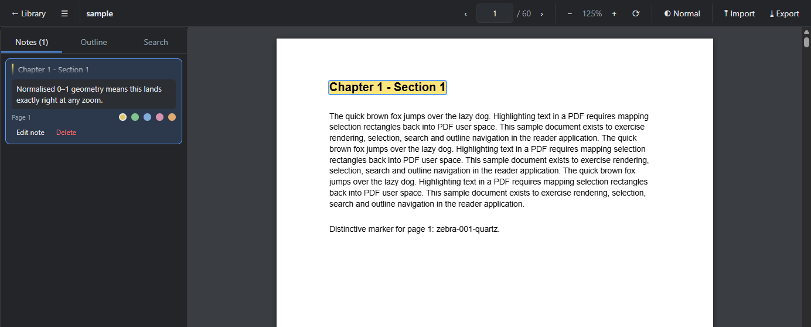

<div align="center">

# 🍊 Marmalade

**A desktop PDF reader for people who read closely.**

Highlight, annotate and search — without ever touching your PDF files.

[](LICENSE)
[](https://www.electronjs.org/)
[](https://react.dev/)
[](https://mozilla.github.io/pdf.js/)



</div>

---

## Why Marmalade

Most readers annotate by rewriting your PDF. Marmalade doesn't.

Your highlights and notes live in a local SQLite database, keyed by each file's
**SHA-256** rather than its path. Rename a document, move it to another folder,
reorganise your whole library — your annotations follow it. The PDF itself is
opened read-only and never modified.

It also assumes you read for hours at a time, so the reading modes are real
modes — sepia and a properly inverted dark mode, with independent brightness and
warmth — not a filter slapped over the window.

## Features

| | |
| --- | --- |
| 🖍️ **Highlights** | Select text, pick from five colours. Geometry is stored normalised, so a highlight made at 100% sits exactly right at 400% and under rotation. |
| 📝 **Notes** | One note per highlight, listed in a sidebar beside the quoted text. |
| 🔍 **Search** | Full-text search within a document, including phrases that PDF.js splits across separate text runs. |
| 🔖 **Outline** | Jump through the document's own bookmarks. |
| 📚 **Library** | Recent documents, each resuming at the exact page and scroll offset you left it at. |
| 🌗 **Reading modes** | Normal, Sepia and inverted Dark, plus brightness and warmth sliders. |
| 🔄 **Portable notes** | Export and import annotations as `.mmnotes.json`. Drop one in and it finds its PDF by hash. |

## Install

Download the installer from [Releases](../../releases) and run it. Windows will
warn that the publisher is unknown — the binaries are unsigned — so choose
**More info → Run anyway**.

Marmalade registers as an *Open with* handler for `.pdf` but deliberately does
**not** seize your default PDF application. To make it the default, use
*Settings → Apps → Default apps*.

Your annotations live in `%APPDATA%\Marmalade\library.db` on Windows and
`~/.config/Marmalade/library.db` on Linux. Uninstalling leaves that file alone,
so reinstalling keeps everything.

## Platform support

Marmalade is built on Electron, React and PDF.js, and nothing in the source is
Windows-only — the handful of platform-specific calls are guarded, and
`better-sqlite3` ships prebuilds for every target below, so no native
compilation is needed anywhere.

| Platform | Status |
| --- | --- |
| **Windows x64** | Built, installed and verified end to end |
| **Linux** (AppImage + `.deb`) | Configured and cross-packs cleanly — **not yet run on hardware** |
| **macOS** | Configured; would need an Apple Developer ID to notarise |

Linux packages must be built on Linux — see
[docs/ARCHITECTURE.md](docs/ARCHITECTURE.md#building-for-linux-and-macos).

## Keyboard shortcuts

| Shortcut | Action |
| --- | --- |
| `Ctrl+O` | Open a PDF |
| `Ctrl+F` | Find in document |
| `F3` / `Shift+F3` | Next / previous match |
| `Ctrl` `+` / `-` / `0` | Zoom in / out / reset |
| `Ctrl+Enter` | Save the note being edited |

## Development

```bash
npm install
npm run dev          # dev window with hot reload
npm test             # unit tests
npm run typecheck    # both TypeScript projects
npm run build:win    # installer -> dist/
```

Architecture, storage internals, the end-to-end harnesses and the trap list all
live in **[docs/ARCHITECTURE.md](docs/ARCHITECTURE.md)**.

## Known limitations

- Search-hit rectangles are derived geometrically from each text run's transform
  and advance width. For proportional fonts this can be off by up to about a
  character at the edges of a match. Highlights made from a real selection are
  exact — only search hits use the approximation.
- Annotations are never written into the PDF, so other readers won't see them.
  Exporting to Markdown, or exporting an annotated copy of the PDF, is not
  implemented.

## Licence

MIT — see [LICENSE](LICENSE).
